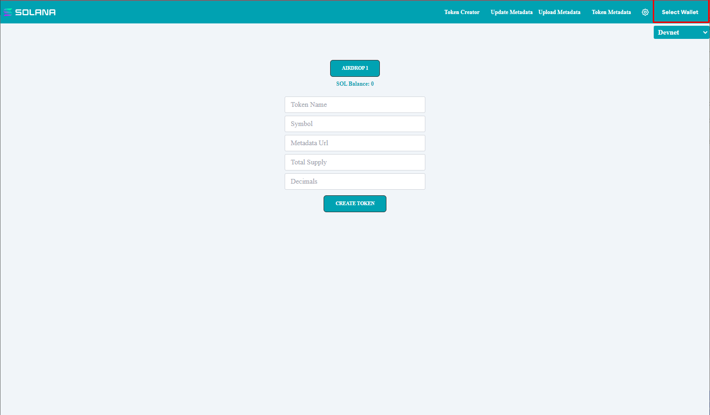
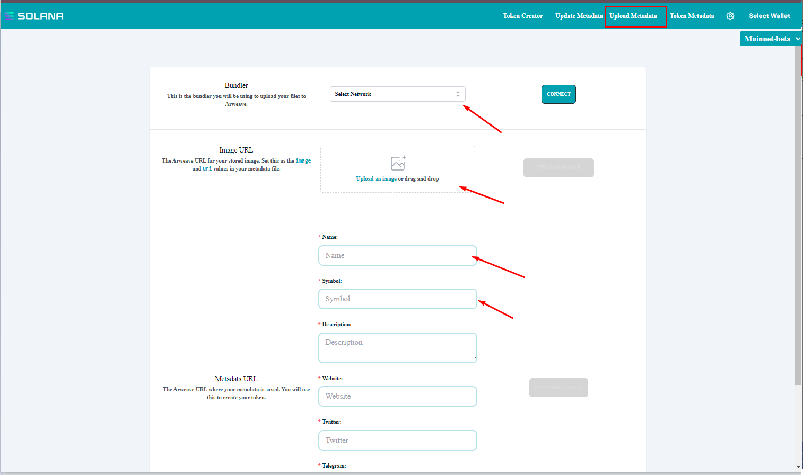
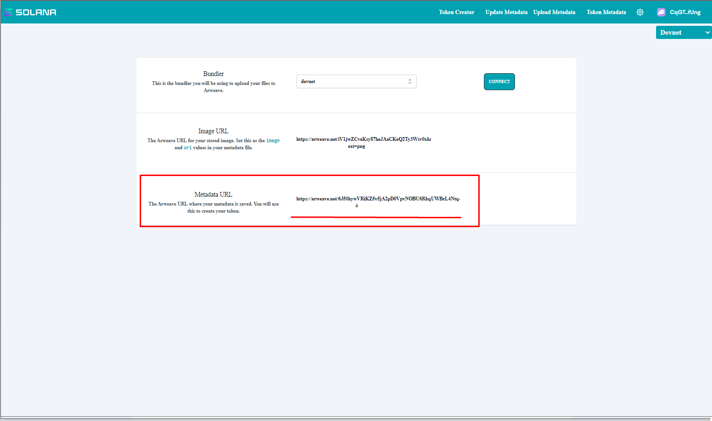
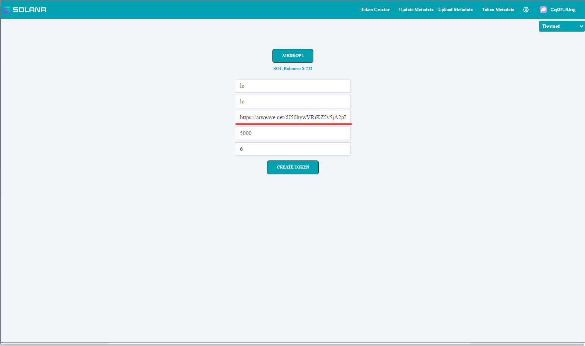
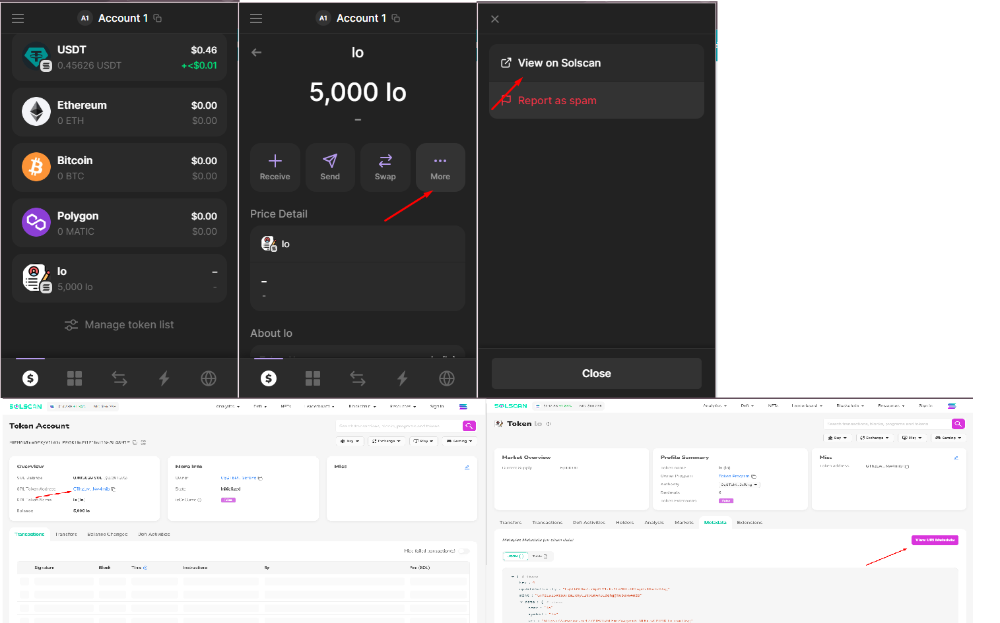
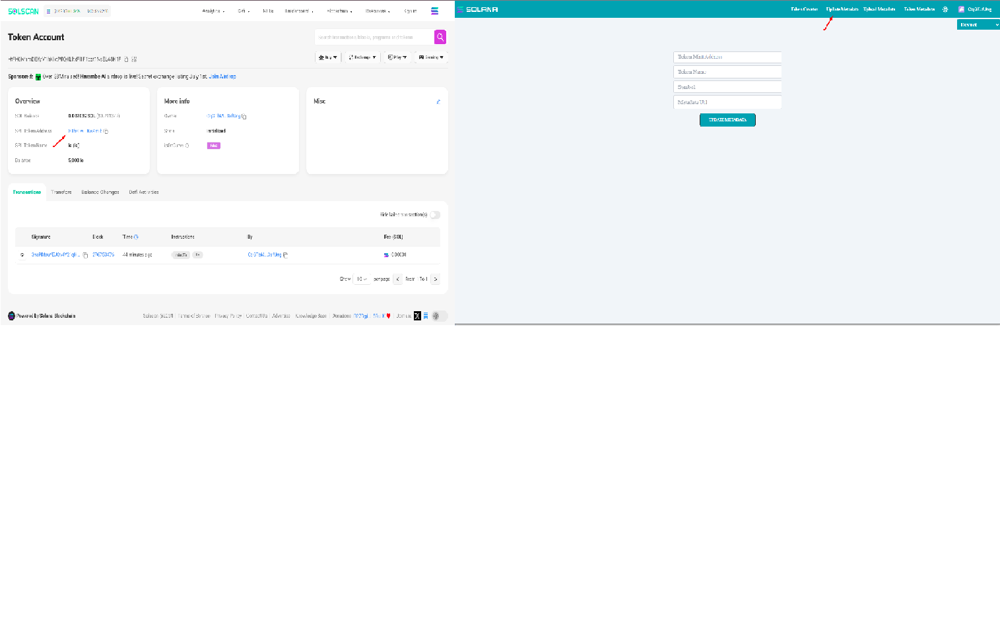

<pre>
<h1># Solana Token Creator</h1>

<h2>## Select Net</h2>

You can select solana net using dropdown list aligned around right corner.
We recommend choosing devnet. If you choose 'mainnet-beta', you have to pay real crypto.

<h2>## Wallent Connect</h2>

You can use 'select wallet' button to select wallet type and 'connect' button to connect to selected wallet.
We recommend 'Phantom Wallet'.

<h2>## Upload MetaData</h2>

Select Network: Choose the network where you want to upload your metadata. This step ensures that you are connected to the right blockchain.

Connect Wallet: Make sure your wallet is connected to the selected network. This allows you to sign transactions and upload data securely.

Upload Image: Choose the image you want to upload. This image will be associated with your token metadata.

Upload Metadata: Fill in the details for your token metadata, such as the name, symbol, and URI. Make sure all the information is correct.

Note Metadata URL: Once the metadata is uploaded, you will receive a URL. Make sure to save this URL as it will be needed to access or verify your metadata in the future.

example for metadata file content:
  {
    "name": "LONE",
    "symbol": "LE",
    "description": "Celebratory Solflare NFT for the Solflare X launch",
    "seller_fee_basis_points": 0,
    "image": "https://arweave.net/WBtBoITC6MrNTOJhFdaqsLOliglRujbCOQPnG2Z5PY0?ext=png",
    "external_url": "https://solflare.com",
    "attributes": [
      {
        "trait_type": "web",
        "value": "yes"
      },
      {
        "trait_type": "mobile",
        "value": "yes"
    },
    {
        "trait_type": "extension",
        "value": "yes"
      }
    ],
    "collection": {
      "name": "UpdatedByFUNC",
      "family": "Solflare" 
    },
    "properties": {
      "files": [
        {
          "uri": "https://arweave.net/WBtBoITC6MrNTOJhFdaqsLOliglRujbCOQPnG2Z5PY0?ext=png",
          "type": "image/png"
        }
      ]
    }
  }

<h2>## Creating a Token</h2>

You need to airdrop sol at 'Token Creator' page using 'Airdrop 1' button to deploy your token to devenet and submit transactions.

And then you can create your token with your specific info.
If you input metadata url, you need to match name and symbol to metadata content.
Please input metadata you noted.

<h2>## Confirming Token</h2>

You can confirm token with any transaction( ex. transfer )

<h2>## Get Token Metadata</h2>

You can confirm the update of token metadata at 'Token Metadata' page.
Here, you only need to input token address and then you will receive token metadata.

Enjoy your new token!
</pre>
